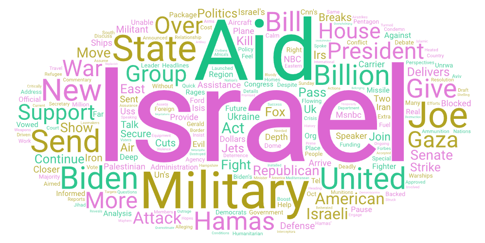
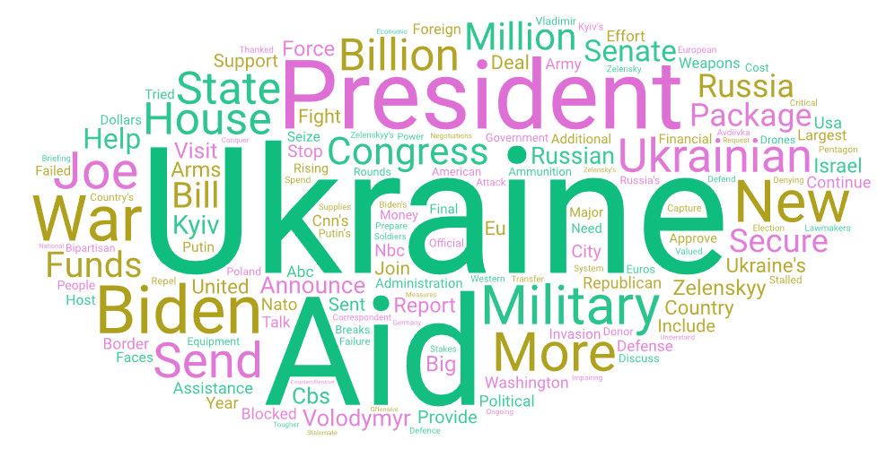

# Geography 458 lab2: Web Data Collection and Visualization

## Topic and Search Terms

Two major conflicts happening in the world right now are the Russia-Ukraine war and the Israel-Hamas war. In both cases the U.S. is allied with one of the belligerents, those being Ukraine and Israel respectively. These conflicts have sparked recent debates within the U.S. political sphere regarding ideas about which countries the U.S. should support and whether the U.S. should be sending aid to countries involved in wars at all. 

For this assignment I wanted to compare how the topic of the U.S. sending aid to these two countries has been covered by the media on YouTube. The circumstances of these two conflicts are quite different with Ukraine being invaded by a major power whereas Israel is engaging a relatively small military organization. There are also the complications and history surrounding Israel and Palestine to take into consideration, and Israel has faced widespread criticism regarding its treatment of Palestinian civilians both throughout this conflict as well as historically. My perception surrounding the discourse regarding sending aid to Israel and Ukraine is that among the government and lawmakers there seems to be a lot of uncritical support for Israel, however among the general population I think support is a lot more split. For Ukraine, it seems that the government and military are strongly in support of aiding Ukraine. Among lawmakers and the general population I think support for Ukraine is fairly high as well but there does seem to be a sizable minority in favor of cutting aid to Ukraine. My goal for this assignment was to see whether these perceptions were supported by and/or reflected in media coverage of the topic. I performed two searches using three key phrases each. For the search regarding Israel I used "US aid Israel", "US sends aid to Israel", "United States aid Israel", and for the Ukraine search I used "US aid Ukraine", "US sends aid to Ukraine", "United States aid Ukraine".

## Word Clouds

## Comparison

Overall the two word clouds are quite similar. Both of course prominently feature the name of the respective country, as well as the forces they're engaged with, Russia, and Hamas, the word "aid" as well as various words relating to President Joe Biden. "Military" is large in both however it's larger in the Israel word cloud. Both feature the words Billion and million, though million is much less prominent in Israel's. Both contain words referring to congress, with Israel's relatively prominently featuring "senate" and "republican" and Ukraine's featuring "senate", "congress" and "republican". One prominent word in Israel's word cloud not present in Ukraine's is "support". Another difference is that Israel's seems to feature more mentions of specific types of weaponry such as "warships", "jets", "carrier", "missile", and "arms", whereas Ukraine's only refers to "drones". Finally, while relatively small, a word I noticed in Israel's not present in Ukraine's is the word "Evil".

## Conclusion

## Data

[Israel search data](assets/search-result-1.csv)
[Ukraine search data](assets/search-result-2.csv)